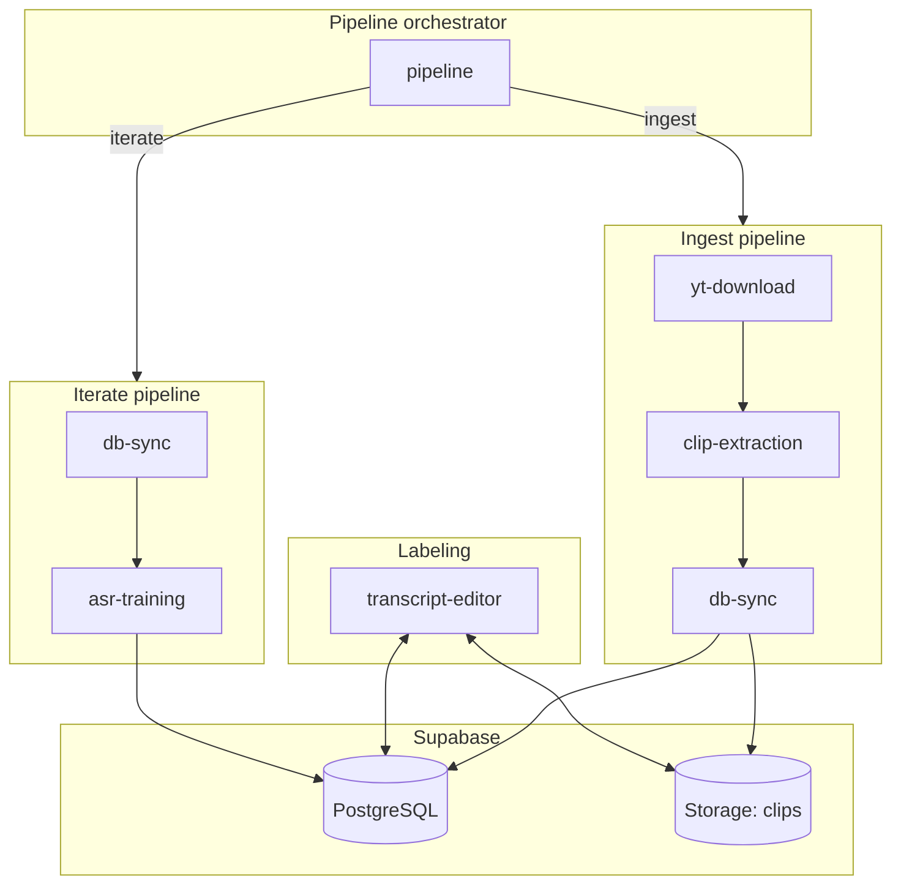

# Ambara — Architecture Overview

This document describes the "big picture" for the Ambara project: how services connect, where data flows, and how to configure and operate the system.

## 1. Overview

Ambara is a Malagasy-to-French voice translator project. The vision is a three-stage pipeline:

| Stage | Component | Role |
|-------|-----------|------|
| Listener | Fine-tuned Whisper | Malagasy speech to text |
| Translator | NLLB-200 | Malagasy text to French (in progress) |
| Speaker | Piper TTS | French text to speech (planned) |

The current focus is building a high-quality Malagasy ASR (automatic speech recognition) dataset by correcting Whisper transcriptions from church recordings. Malagasy is a low-resource language; stock Whisper handles it poorly. The approach:

1. Download audio from YouTube (church services, sermons)
2. Extract clean speech clips (filter out singing and music)
3. Run Whisper for draft transcripts
4. Manually correct transcripts in the web editor
5. Fine-tune Whisper on corrected data
6. Re-draft pending clips with the improved model
7. Repeat — each round produces better drafts, which are faster to correct

The initial focus is on the Merina dialect (spoken in Antananarivo and the central highlands).

## 2. System Architecture

All services connect through Supabase as the central data store.



**Data flows:**

- **Ingest**: `yt-download` -> `clip-extraction` -> `db-sync` -> Supabase (runs, clips, storage)
- **Labeling**: `transcript-editor` reads from and writes to Supabase
- **Iterate**: `db-sync` (export) -> `asr-training` (train + re-draft) -> Supabase (updated draft transcriptions)

The `pipeline` service orchestrates both ingest (download + extract + sync) and iterate (export + train + re-draft) workflows.

## 3. Service Map

| Service | Language | Purpose | External Dependencies |
|---------|----------|---------|----------------------|
| shared | Python | Audio I/O utilities, shared models | ffmpeg |
| yt-download | Python | YouTube audio download as WAV | yt-dlp, ffmpeg |
| clip-extraction | Python | VAD + classify + transcribe -> clips | PyTorch, Transformers (Silero, AST, Whisper) |
| db-sync | Python | Sync runs to Supabase, export data | Supabase |
| asr-training | Python | Whisper fine-tuning, re-draft pending | PyTorch, Transformers, HuggingFace |
| pipeline | Python | Orchestrate ingest and iterate workflows | All Python services |
| transcript-editor | TypeScript | Web UI for correcting transcripts | Next.js, Supabase, WaveSurfer |

## 4. End-to-End Data Flow

### Ingest

```bash
./ambara ingest <url-or-file> -l <label> [--device mps]
```

1. **Download** (if URL): `yt-download` fetches audio from YouTube and converts to 16kHz mono WAV at `data/input/<label>.wav`.
2. **Extract**: `clip-extraction` runs:
   - Silero VAD — detects speech regions
   - Segment grouping — merges into 5–30 second clips
   - AST classifier — filters out singing/music
   - Whisper — generates draft Malagasy transcripts
3. **Output**: timestamped run directory (e.g. `data/output/20260222_201500_<label>/`) with `clips/*.wav` and `metadata.csv`.
4. **Sync**: `db-sync` creates a run in Supabase, uploads clips to Storage, and upserts metadata into the `clips` table.

### Label

1. Start the editor: `./ambara editor` (opens http://localhost:3000).
2. Log in via magic link (Supabase Auth).
3. Select a run from the run list.
4. Correct clips: change `draft_transcription` to `corrected_transcription`, set `status` to `corrected` or `discarded` as needed.
5. Edits are written to Supabase and logged in `clip_edits`.

### Iterate

```bash
./ambara iterate -l <label> [--device mps]
```

1. **Export**: `db-sync` exports corrected clips (status = `corrected`) as a HuggingFace audiofolder dataset to `data/training/<dataset>/` (train/test split).
2. **Train**: `asr-training` fine-tunes Whisper small on the exported data, saves to `models/whisper-mg-v1/model/`.
3. **Re-draft**: `asr-training` re-transcribes all pending clips with the fine-tuned model and updates `draft_transcription` in Supabase for those clips.
4. Corrected clips are left unchanged; their transcriptions stay as the source of truth.

Repeat **Label** and **Iterate**. Each iteration improves drafts for pending clips, reducing correction effort.

## 5. Database Schema

Reference: `docs/supabase/001_schema.sql`.

| Table | Purpose |
|-------|---------|
| runs | Extraction runs (label, source path, timestamps) |
| clips | Per-clip metadata and transcriptions; one row per WAV |
| clip_edits | Append-only history of corrections |

### Key relationships

- `clips.run_id` -> `runs.id` (CASCADE on delete)
- `clip_edits.clip_id` -> `clips.id` (CASCADE on delete)

### Clips fields (high level)

| Field | Role |
|-------|------|
| `file_name` | Relative path (e.g. `clips/clip_00001.wav`) |
| `draft_transcription` | Whisper output (or re-draft output) |
| `corrected_transcription` | Human-corrected text |
| `status` | `pending`, `corrected`, or `discarded` |
| `speech_score`, `music_score` | Classifier confidence values |

Only clips with `status = corrected` are exported for training.

## 6. Storage Layout

### Supabase Storage (bucket: `clips`)

| Path pattern | Contents |
|--------------|----------|
| `{runId}/clips/{filename}.wav` | Extraction clips (main pipeline) |
| `{runId}/chunks/{filename}.wav` | Chapter/reading mode chunks (optional) |

### Local directories

| Path | Purpose |
|------|---------|
| `data/input/` | Raw downloads (e.g. `<label>.wav`) |
| `data/output/` | Extraction runs (timestamped dirs with `clips/` and `metadata.csv`) |
| `data/training/` | Exported datasets (HuggingFace audiofolder format) |
| `models/` | Saved fine-tuned Whisper models |

## 7. Configuration

### Root `.env` (Python services: db-sync, asr-training, pipeline)

```env
SUPABASE_URL=https://your-project.supabase.co
SUPABASE_SERVICE_ROLE_KEY=your-service-role-key
```

### `services/transcript-editor/.env.local` (Next.js)

```env
NEXT_PUBLIC_SUPABASE_URL=https://your-project.supabase.co
NEXT_PUBLIC_SUPABASE_ANON_KEY=your-anon-key
```

### Supabase setup

1. Create a Supabase project.
2. Create a private storage bucket named `clips` in the dashboard.
3. Run SQL scripts in the Supabase SQL editor, in order:
   - `docs/supabase/001_schema.sql`
   - `docs/supabase/002_rls.sql`
   - `docs/supabase/003_storage.sql`

## 8. CLI Reference

All commands are invoked via `./ambara <command> [options]`.

### Pipeline (composite)

| Command | Description |
|---------|-------------|
| `ingest <url-or-file> -l <label>` | Download (if URL) + extract + sync to Supabase |
| `iterate -l <label>` | Export corrected clips + train Whisper + re-draft pending |
| `editor` | Start transcript correction UI (Next.js dev server) |

### Individual steps

| Command | Description |
|---------|-------------|
| `download <url> [-l <label>]` | Download YouTube audio as 16kHz mono WAV |
| `extract -i <input> -o <output> [-l <label>]` | Run full clip extraction pipeline |
| `vad-only --input <file> --output <file>` | Run VAD detection only (no classification/transcription) |
| `sync --dir <run-dir>` | Sync extraction run to Supabase |
| `export [--run <uuid> \| --label <label>] -o <file>` | Export corrected clips to CSV |
| `export-training [-l <label> \| --run <uuid>] [-d <source-dir>]` | Export corrected clips as training dataset |
| `train -d <data-dir> [-o <model-dir>]` | Fine-tune Whisper on exported data |
| `re-draft --model <path> [-d <source-dir>] -l <label>` | Re-transcribe pending clips with fine-tuned model |

### Database management

| Command | Description |
|---------|-------------|
| `dump` | Dump all table data as SQL (backup before migrations) |
| `delete-run [--label <label> \| --run <uuid>]` | Delete a run and all its data |
| `reset` | Wipe all runs, clips, edits, and storage |
| `cleanup` | Remove orphaned runs and storage objects |

### Setup

| Command | Description |
|---------|-------------|
| `setup` | Create venv and install all packages |
| `install` | Install local packages (editable) |
| `help` | Show usage (default when no command given) |
