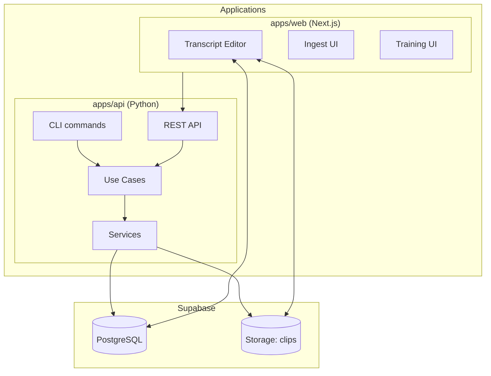

# Ambara — Architecture Overview

This document describes the "big picture" for the Ambara project: how services connect, where data flows, and how to configure and operate the system.

## 1. Overview

Ambara is a Malagasy-to-French voice translator project. The vision is a three-stage pipeline:

| Stage | Component | Role |
|-------|-----------|------|
| Listener | Fine-tuned Whisper | Malagasy speech to text |
| Translator | NLLB-200 | Malagasy text to French (in progress) |
| Speaker | Piper TTS | French text to speech (planned) |

The current focus is building a high-quality Malagasy ASR (automatic speech recognition) dataset by correcting Whisper transcriptions from church recordings. Malagasy is a low-resource language; stock Whisper handles it poorly. The approach:

1. Download audio from YouTube (church services, sermons)
2. Extract clean speech clips (filter out singing and music)
3. Run Whisper for draft transcripts
4. Manually correct transcripts in the web editor
5. Fine-tune Whisper on corrected data
6. Re-draft pending clips with the improved model
7. Repeat — each round produces better drafts, which are faster to correct

The initial focus is on the Merina dialect (spoken in Antananarivo and the central highlands).

## 2. System Architecture

The platform is organized into two main applications that share Supabase as the central data store.


```mermaid
flowchart TB
    subgraph Apps["Applications"]
        direction TB
        subgraph API["apps/api (Python)"]
            CLI[CLI commands]
            REST[REST API]
            UC[Use Cases]
            SVC[Services]
        end
        subgraph Web["apps/web (Next.js)"]
            TE[Transcript Editor]
            INGEST[Ingest UI]
            TRAIN[Training UI]
        end
    end

    subgraph Supabase["Supabase"]
        DB[(PostgreSQL)]
        STORAGE[(Storage: clips)]
    end

    CLI --> UC
    REST --> UC
    UC --> SVC
    SVC --> DB
    SVC --> STORAGE
    TE <--> DB
    TE <--> STORAGE
    Web --> REST
```

**Data flows:**

- **Ingest**: CLI or Web UI -> `ingest` use case -> download + extract + sync to Supabase
- **Labeling**: Web editor reads clips and writes corrections to Supabase
- **Training**: CLI or Web UI -> `export` + `train` + `redraft` use cases -> improved draft transcriptions

The unified CLI (`./ambara`) provides commands for all workflows, while the REST API enables the web interface.

## 3. Application Structure

| Application | Language | Purpose | Key Components |
|-------------|----------|---------|----------------|
| apps/api | Python | Backend services and CLI | Domain entities, use cases, ML services, Supabase repositories |
| apps/web | TypeScript | Web UI for labeling and monitoring | Next.js, transcript editor, job progress tracking |

### apps/api Layers

| Layer | Path | Purpose |
|-------|------|---------|
| domain | `src/domain/` | Entities (Clip, Run, Job), ports (interfaces), exceptions |
| application | `src/application/` | Use cases (ingest, export, redraft) and services (clip extraction, training) |
| infrastructure | `src/infra/` | Supabase repositories, ML clients (VAD, classifier, Whisper), YouTube downloader |
| ports | `src/ports/` | CLI (Typer) and REST API (FastAPI) entry points |

### apps/web Structure

| Path | Purpose |
|------|---------|
| `src/app/` | Next.js pages: runs list, clip editor, ingest, training |
| `src/components/` | UI components: ClipEditor, ClipList, JobProgressCard |
| `src/hooks/` | React hooks: useClipsData, useAudioUrls, useJobPolling |
| `src/lib/` | Utilities: Supabase client, audio processing, formatting |

## 4. End-to-End Data Flow

### Ingest

```bash
./ambara ingest <url-or-file> -l <label> [--device mps]
```

1. **Download** (if URL): YouTube audio is fetched and converted to 16kHz mono WAV at `data/input/<label>.wav`.
2. **Extract**: The clip extraction service runs:
   - Silero VAD — detects speech regions
   - Segment grouping — merges into 5–30 second clips
   - AST classifier — filters out singing/music
   - Whisper — generates draft Malagasy transcripts
3. **Output**: timestamped run directory (e.g. `data/output/20260222_201500_<label>/`) with `clips/*.wav` and `metadata.csv`.
4. **Sync**: Creates a run in Supabase, uploads clips to Storage, and upserts metadata into the `clips` table.

### Label

1. Start the editor: `./ambara editor` (opens http://localhost:3000).
2. Log in via magic link (Supabase Auth).
3. Select a run from the run list.
4. Correct clips: change `draft_transcription` to `corrected_transcription`, set `status` to `corrected` or `discarded` as needed.
5. Edits are written to Supabase and logged in `clip_edits`.

### Iterate

```bash
./ambara export --run-id <uuid> [--run-id <uuid>]
./ambara train -d <data-dir> [--device mps]
./ambara redraft --run-id <uuid> --model <path> [--device mps]
```

1. **Export**: Exports corrected clips (status = `corrected`) as a HuggingFace audiofolder dataset to `data/output/<dataset>/` (train/test split).
2. **Train**: Fine-tunes Whisper small on the exported data, saves to `models/whisper-mg-v1/model/`.
3. **Re-draft**: Re-transcribes all pending clips with the fine-tuned model and updates `draft_transcription` in Supabase for those clips.
4. Corrected clips are left unchanged; their transcriptions stay as the source of truth.

Repeat **Label** and **Iterate**. Each iteration improves drafts for pending clips, reducing correction effort.

## 5. Database Schema

Reference: `docs/supabase/001_schema.sql`.

| Table | Purpose |
|-------|---------|
| runs | Extraction runs (label, source path, timestamps) |
| clips | Per-clip metadata and transcriptions; one row per WAV |
| clip_edits | Append-only history of corrections |

### Key relationships

- `clips.run_id` -> `runs.id` (CASCADE on delete)
- `clip_edits.clip_id` -> `clips.id` (CASCADE on delete)

### Clips fields (high level)

| Field | Role |
|-------|------|
| `file_name` | Relative path (e.g. `clips/clip_00001.wav`) |
| `draft_transcription` | Whisper output (or re-draft output) |
| `corrected_transcription` | Human-corrected text |
| `status` | `pending`, `corrected`, or `discarded` |
| `speech_score`, `music_score` | Classifier confidence values |

Only clips with `status = corrected` are exported for training.

## 6. Storage Layout

### Supabase Storage (bucket: `clips`)

| Path pattern | Contents |
|--------------|----------|
| `{runId}/clips/{filename}.wav` | Extraction clips (main pipeline) |
| `{runId}/chunks/{filename}.wav` | Chapter/reading mode chunks (optional) |

### Local directories

| Path | Purpose |
|------|---------|
| `data/input/` | Raw downloads (e.g. `<label>.wav`) |
| `data/output/` | Extraction runs (timestamped dirs with `clips/` and `metadata.csv`) |
| `data/training/` | Exported datasets (HuggingFace audiofolder format) |
| `models/` | Saved fine-tuned Whisper models |

## 7. Configuration

### Root `.env` (Python API)

```env
SUPABASE_URL=https://your-project.supabase.co
SUPABASE_SERVICE_ROLE_KEY=your-service-role-key
```

### `apps/web/.env.local` (Next.js)

```env
NEXT_PUBLIC_SUPABASE_URL=https://your-project.supabase.co
NEXT_PUBLIC_SUPABASE_ANON_KEY=your-anon-key
API_URL=http://localhost:8000
```

### Supabase setup

1. Create a Supabase project.
2. Create a private storage bucket named `clips` in the dashboard.
3. Run SQL scripts in the Supabase SQL editor, in order:
   - `docs/supabase/001_schema.sql`
   - `docs/supabase/002_rls.sql`
   - `docs/supabase/003_storage.sql`

## 8. CLI Reference

All commands are invoked via `./ambara <command> [options]`.

### Main Commands

| Command | Description |
|---------|-------------|
| `ingest <url-or-file> -l <label>` | Download (if URL) + extract + sync to Supabase |
| `sync --dir <run-dir>` | Sync a local extraction run to Supabase |
| `export --run-id <uuid>` | Export corrected clips as a training dataset |
| `train -d <data-dir>` | Fine-tune Whisper on exported training data |
| `redraft --run-id <uuid> --model <path>` | Re-transcribe pending clips |
| `delete-run --run-id <uuid>` | Delete a run and all its data |
| `api` | Start the REST API server |
| `editor` | Start the web editor (Next.js dev server) |

### Setup

| Command | Description |
|---------|-------------|
| `setup` | Create venv and install all packages |
| `install` | Install local packages (editable) |
